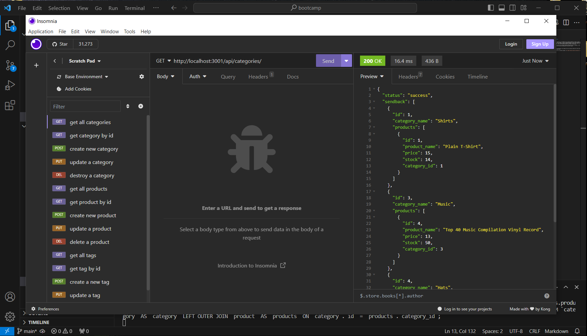

# **Module 13 Challenge:** E-Commerce Backend

## Description

The goal of this project was to create a backend for an e-commerce site, using the sequelize, express, mysql2, and dotenv packages. Throught the implementation of these packages, a user may send CRUD requests to the server and get responses back. This project involves CRUD routes for three separate models: Category, Product, and Tag, with Category and Product maintaining a One-To-Many relationship, and Product and Tag maintaining a Many-To-Many relationship. 

The largest difficulty encountered while working on this project involved the delete route for Category, as the "ON DELETE: CASCADE" functionality wasn't working initially and required a few server reloads.

## Preview

The video linked here provides an example walkthrough of the requests that can be made, along with a brief waltz through the code: [Request video run-through](https://drive.google.com/file/d/1rr6jK6CX8Vj7_sHd6VFs6B3FJrE01qYB/view)

Provided here is a screenshot of Insomnia with a successful request: 